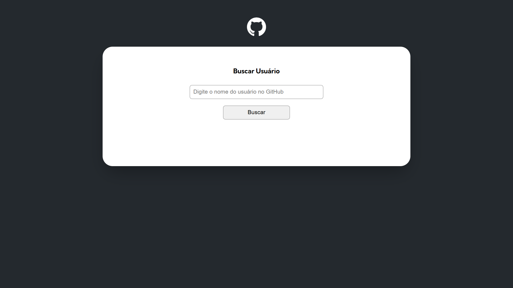

# Desafio JavaScript Avançado - Fetch GitHub API

## Descrição

Este projeto é uma aplicação web que utiliza a API do GitHub para buscar e exibir informações sobre repositórios e usuários. O objetivo é fornecer uma interface simples e intuitiva para interagir com a API do GitHub.

## Tecnologia

- HTML
- CSS
- JavaScript

## Uso

Após acessar a página hosteado no [GitHub Pages](https://fscarini.github.io/github-get-user/), você poderá interagir com a aplicação e realizar buscas na API do GitHub digitando o nome de um usuário válido. É responsivo para mobile e desktop.
